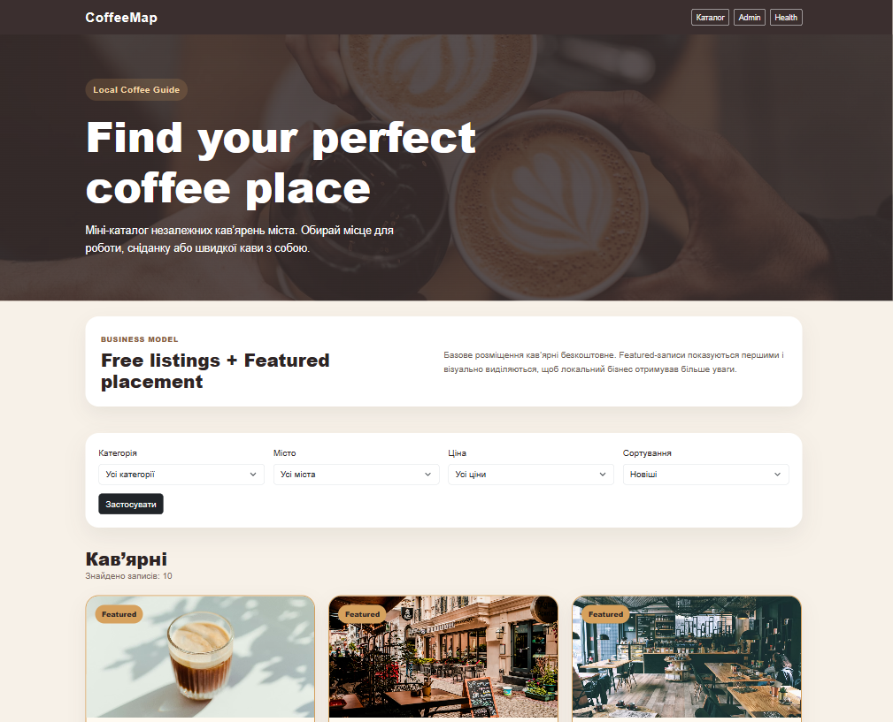
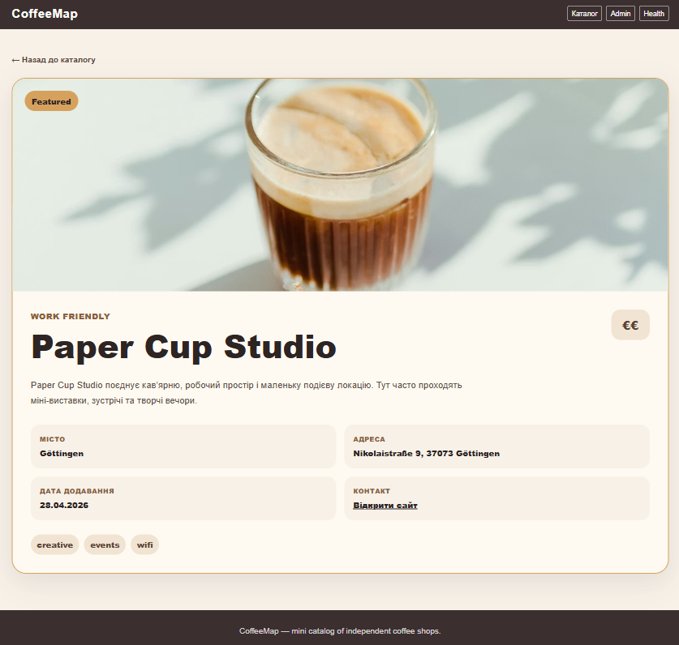
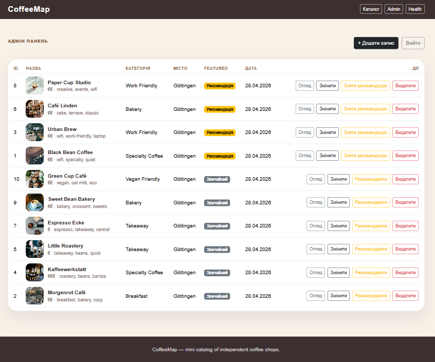
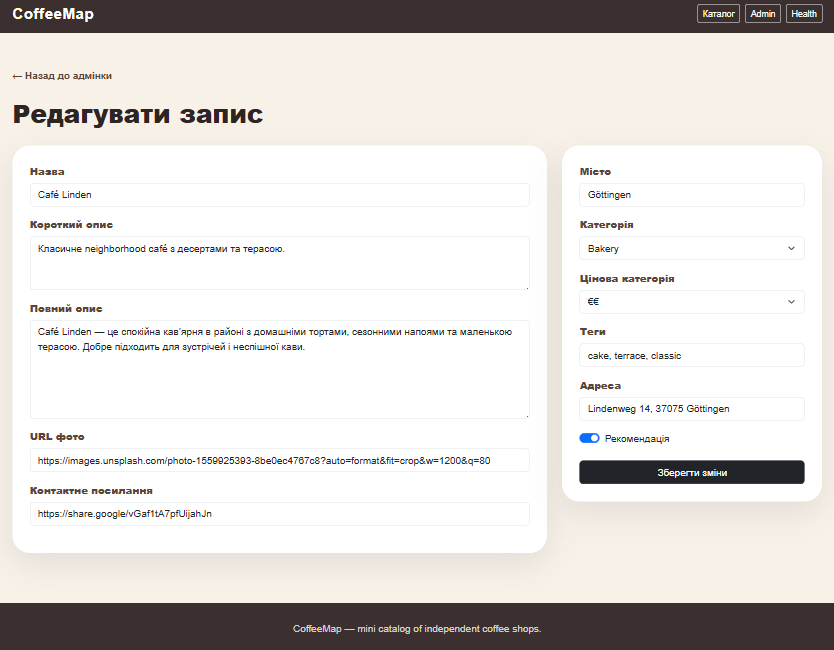
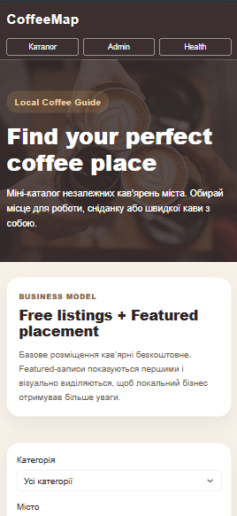

# CoffeeMap

CoffeeMap is a mini catalog of independent local coffee shops.  
The project was created as a one-week pilot task with a public catalog, item details page, admin panel, PostgreSQL database and Docker setup.

## Business idea

CoffeeMap helps users find local independent coffee shops by category, city and price level.

The business model is based on **free basic listings + paid Featured placement**.

Basic listings are free, so the catalog can grow and become useful for users. Coffee shop owners can pay for Featured placement. Featured coffee shops are shown first on the homepage and visually highlighted with a badge and special border. This works because local coffee shops need more visibility, while users want to quickly discover interesting and trusted places.

## Features

### Public part

- homepage with coffee shop cards;
- item details page;
- filters by category, city and price level;
- sorting by newest, alphabetical and price level;
- Featured listings shown first;
- custom 404 page;
- responsive layout.

### Admin part

- simple password-protected admin login;
- admin dashboard with all listings;
- create listing;
- edit listing;
- delete listing with confirmation;
- toggle Featured status;
- form validation.

### Infrastructure

- Docker Compose setup;
- PostgreSQL database in Docker;
- SQLAlchemy models;
- Flask-Migrate migrations;
- seed script with 10 realistic records;
- environment variables via `.env`;
- `.env.example` included.

## Tech stack

- Python
- Flask
- PostgreSQL
- SQLAlchemy
- Flask-Migrate
- Jinja Templates
- Bootstrap
- Docker Compose

## Project structure

```text
coffeemap/
├── app/
│   ├── __init__.py
│   ├── routes.py
│   ├── admin.py
│   ├── models.py
│   ├── seed.py
│   ├── templates/
│   │   ├── base.html
│   │   ├── index.html
│   │   ├── item_detail.html
│   │   ├── 404.html
│   │   └── admin/
│   │       ├── login.html
│   │       ├── dashboard.html
│   │       ├── item_form.html
│   │       └── delete_confirm.html
│   └── static/
│       └── css/
│           └── style.css
├── migrations/
├── Dockerfile
├── docker-compose.yml
├── requirements.txt
├── README.md
├── .env.example
└── run.py
```

## Screenshots

### Homepage



### Item details



### Admin dashboard



### Admin form



### Mobile homepage



## How to run

1. Clone the repository:

```bash
git clone https://github.com/Maksym-Filvarok/coffeemap-flask.git
cd coffeemap
```

2. Create `.env` from `.env.example`:

```bash
cp .env.example .env
```

On Windows PowerShell:

```powershell
Copy-Item .env.example .env
```

3. Start the project:

```bash
docker compose up --build
```

4. Apply migrations:

```bash
docker compose exec web flask db upgrade
```

5. Seed the database:

```bash
docker compose exec web python -m app.seed
```

6. Open the website:

```text
http://localhost:5000
```

## Admin panel

Admin login page:

```text
http://localhost:5000/admin/login
```

The admin password is stored in `.env`:

```env
ADMIN_PASSWORD=admin123
```

## Healthcheck

```text
http://localhost:5000/health
```

Expected response:

```json
{
  "status": "ok"
}
```

## Main routes

```text
/                         Public catalog
/items/<id>               Item details page
/admin/login              Admin login
/admin                    Admin dashboard
/admin/items/new          Create item
/admin/items/<id>/edit    Edit item
/admin/items/<id>/delete  Delete confirmation
/health                   Healthcheck endpoint
```